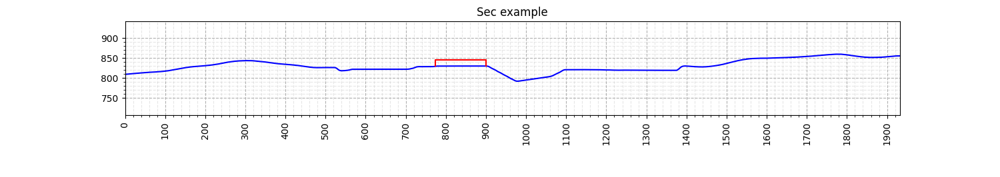

*********
Altimetry
*********

The **Altimetry** module contains the objects and functions needed for plotting **altimetric profiles**.
These profiles are delivered as an artifact to consulting clients.
They are used for a quick scout of the terrain profile which includes the buildings that are going to be built.

Altimetric profiles are generated from sectioning a terrain surface by defining a cutting plane.
This plane is defined by its normal and an origin point.

For consulting cases, the plane is generated from a list of probes, defined in a csv table.
The format of this table is as it follows:

.. list-table:: Standard probes csv table for altimetry
   :widths: 10 10 15 5 5 5 20
   :header-rows: 1

   * - Case
     - Section
     - Building
     - X
     - Y
     - Z
     - Probe name
   * - 000
     - A
     - BL01
     - 100
     - 200
     - 830
     - BL01-000-A
   * - 090
     - B
     - BL01
     - -100
     - -250
     - 840
     - BL01-090-B

The probe name is conventioned to be a result of the combination of section, case and building labels.
In a way that the probe name can be seen as **{building}-{case}-{section}**.

However the user can name the probe as they wish, the altimetry module will handle it.

There are several ways to use **altimetry** module. The main one is to run as a module, using:

.. code-block:: Bash

   poetry run python -m cfdmod.use_cases.altimetry --csv {CSV_PATH} --surface {SURFACE_PATH} --output {OUTPUT_PATH}

Where the arguments are the paths of the probe **table file**, terrain **surface STL** and the **simulation case path** for saving the images of the **altimetric profiles**.

You can also use the example notebook, found in `notebooks/example/altimetry.ipynb <altimetry.ipynb>`_

.. toctree::
   :maxdepth: -1
   :hidden:

   Altimetry example<altimetry.ipynb>

Using the altimetry module, the user can generate the altimetric profiles, as well as debug figures to overlook the probes position and the section profile.
The altimetric profile should look like this:

The debug figures should look like this:

.. figure:: surface.png